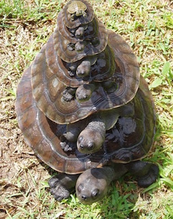

# Programming Complexity

One of the more fascinating new sciences that came up in recent decades (yes, science takes decades) is complexity science. Complexity science is the study of complex systems, systems where many different components interact with one another to produce behaviors that are not easily explained from observing the individual components. An example of this is the way fish swim in the same direction in a coordinated way(i.e. how fish school). From observation and [mathematical modeling][1], fish were simulated to school from individual behaviors that are as simple as:

1. Remain close to your neighbours
2. Avoid collisions with your neighbours

This simple rules however don't tell the story of the spectacular way of how 'barracuda tornadoes' form from thousands of fish as they circle round and round in a vortex to avoid being fixed up as prey in the eyes of the predator.


Schooling fish is an obvious example of a complex system, but there are complex systems all around us. If you observe our daily lives you'd realize that the everyday culture you're used to is likely be a hodge-podge mix of multiple cultures. What you identify as a national or local culture is probably an eclectic mixture of a number of other cultures, which in turn are also a mix of even more other cultures. 

For example, take [laksa](https://en.wikipedia.org/wiki/Laksa), a popular spicy noodle soup dish in Singapore, Malaysia, Indonesia and southern Thailand. Its origins are believed to have been from Chinese coastal settlements, which took on a local twist as Chinese immigrants introduced local ingredients and cooking methods. And as local ingredients go, this can be coconut milk (resulting in variants of curry laksa), tamarind (resulting in variants of assam laksa), sambal belacan, various species of fish and even lemongrass! This results in a delightful and dizzying variety of variants that are simply edible embodiment of the local cultural mix.


Similarly, we find linguistic equivalents in [Singlish](https://en.wikipedia.org/wiki/Singlish), an English-based creole language spoken in Singapore, containing words originating from English, Malay, various dialects of Chinese and Indian languages, and also in [Bahasa Rojak](https://en.wikipedia.org/wiki/Bahasa_Rojak) a Malaysian pidgin language formed by code-switching between English, Malay, various dialects of Chinese and Indian languages in Malaysia. If we dig deeper, various things we take for granted as being iconic to a culture, often have origins in other cultures for e.g. [English tea](https://www.tea.co.uk/history-of-tea) (which came from China) and [Zen Buddhism](https://en.wikipedia.org/wiki/Zen) (popularized in the West through Japanese Zen, which came from Chan Buddhism, which originated in China and was influenced by Taoism, but in turn is a school of Mahayana Buddhism which came from India).

As Stephen Hawkings wrote in the open to "A Brief History of Time" -- it's turtles all the way down.



How people and cultures interact and influence each other is the subject of numerous research. Various social scientists, anthropologists and biologists have studied cultural changes, came up with plausible theories and have written papers to describe these theories. One such [paper][2] by Robert Axelrod, a seminal one that has been referenced in much later research, built an agent-based model that follows a set of simple rules in an attempt to produce emergent behavior (that is, he built a model of a complex system).

I've attempted to do an alternate agent-based model based on the rules described on Axelrod's paper. I used Ruby to simulate the model and React to visual it. 

The model I used is based on two very simple premises:

1. Cultures that are similar to each other are more likely to interact that cultures that are not
2. When cultures interact they become more alike each other

Using these two premises, I built a model using a square 36x36 grid. Each cell in the grid represents a culture. 


In the simulation, each culture has 6 features, where a feature is an attribute of a culture like food, language, religion etc. 


Each feature in turn has 16 different traits, which are the different possible values of the feature.


As you probably realize, this is obviously modeled to make it easier for me to describe the grid in hexadecimal colors.


Let's see how the simulation works. Each cell (culture) has 8 neighbors, unless it is a corner or cell.


At every interval, the simulation randomly picks n number of cultures. The selected culture is compared with its neighbors, feature to feature. The difference between one culture and another, which I call the cultural difference, is the probability that one culture will influence the other. If there is cultural influence, the simulation chooses a random trait to copy to the other culture, making it more similar to each other.

In the example below, take 2 cultures A and B that are next to each other (i.e. they are neighbors). Now compare them feature to feature. In the figure below, the difference between two features, or feature difference is 3. Note that we're only looking for the difference between the two features, so we are getting the absolute number, and not simple subtracting one number from another.


Next, we add up all the features differences between the two cultures to get a cultural difference. In the figure below, we get a cultural difference of 34 (if we step back a bit you'd realize that we've just reduced the difference between two cultures to a single number, but that's the nature of modeling).


A quick arithmetic check wtill tell us that if two cultures are completely different from each other, their cultural difference is 96, and if they are exactly the same, their cultural difference is 0. Therefore, the probability that there will be cultural exchange is:


Finally, if cultural exchange does happen, the simulation will randomly pick one feature and copy the trait value from a culture to another. In this case, culture A's feature 3 is copied to culture B.


Let's take a look at the simulation code next. First, we need to build out the grid using a Grid class, which is subclassed from Array. Here's the code in a file named grid.rb.

```ruby
class Grid < Array
  attr :width
  
  def initialize(size)
    @width = size
    (size*size).times do |i|
      self[i] = Random.rand(0xFFFFFF)
    end    
  end

  def find_neighbours_index(n)
    nb = []
  	case
  	when top_left(n)
  		nb << c5(n) << c7(n) << c8(n)
  	when top_right(n)
  		nb << c4(n) << c6(n) << c7(n)		
  	when bottom_left(n)
  		nb << c2(n) << c3(n) << c5(n)
  	when bottom_right(n)
  		nb << c1(n) << c2(n) << c4(n)
  	when top(n)
  		nb << c4(n) << c5(n) << c6(n) << c7(n) << c8(n)
  	when left(n)
  		nb << c2(n) << c3(n) << c5(n) << c7(n) << c8(n)
  	when right(n)
  		nb << c1(n) << c2(n) << c4(n) << c6(n) << c7(n)
  	when bottom(n)
  		nb << c1(n) << c2(n) << c3(n) << c4(n) << c5(n)
  	else
  		nb << c1(n) << c2(n) << c3(n) << c4(n) << c5(n) << c6(n) << c7(n) << c8(n)
    end
  	nb
  end


  def top_left(n)      n == 0; end
  def top_right(n)     n == @width-1; end
  def bottom_left(n)   n == @width*(@width-1); end
  def bottom_right(n)  n == (@width*@width)-1; end
  
  def top(n)    n < @width; end
  def left(n)   (n%@width) == 0; end
  def right(n)  (n%@width) == @width-1; end
  def bottom(n) n >= (@width*(@width-1)); end
  
  def c1(n) n - @width - 1; end
  def c2(n) n - @width; end    
  def c3(n) n - @width + 1; end
  def c4(n) n - 1; end
  def c5(n) n + 1; end
  def c6(n) n + @width - 1; end        
  def c7(n) n + @width; end
  def c8(n) n + @width + 1; end
      
end

```

When we create an instance of Grid, all its cells are initialized with random colors. The main method that is used is `find_neighbours_index` which returns an array of the indices of the neighbors in the grid. As you can see from the code, the corner cells have 3 neighbors, the edge cells have 5 neighbors and the rest all have 8 neighbors.

The main simulation code is in the CultureSimulation class, in a file named culture.rb.

```ruby
class CultureSimulation 
  attr :grid, :fdistances, :changes, :uniques, :mask, :mask_array, :size
  
  def initialize(size=36) 
    @grid = Grid.new(size)
    @size = size
    @mask = 0x000000F
    @mask_array = [0xFFFFF0, 0xFFFF0F, 0xFFF0FF, 0xFF0FFF, 0xF0FFFF, 0x0FFFFF]
    @cdistances, @changes, @uniques = [], [], []      
  end
  
  def tick
  	change = 0
  	(@grid.size * @grid.size/3).times do |c|
  		r = Random.rand(@grid.size)
  		neighbours = @grid.find_neighbours_index(r)
  		neighbours.each do |neighbour|
  			d = diff(r, neighbour)
  			probability = 1 - d/96.0
  			if Random.rand < probability then
  				i = Random.rand(6)
  				if d != 0 then
  					rp = 0
  					if Random.rand(1) == 0 then
  						replacement = extract(@grid[r], i)
  						rp = replace(@grid[neighbour], replacement, i)
  					else 
  						replacement = extract(@grid[neighbour], i)
  						rp = replace(@grid[r], replacement, i)
            end
  					@grid[neighbour] = rp
  					change += 1
          end
        end
      end
    end
  	@cdistances << cultural_distance_average
  	@changes << change/@size
  	@uniques << @grid.uniq.size
  end
  
  def diff(a1, a2)
    difference = 0
    6.times do |i|
  		difference += trait_distance(@grid[a1], @grid[a2], i)
    end
  	difference
  end
  
  def cultural_distance_average
  	count, dist = 0, 0
    @grid.size.times do |c|
  		neighbours = @grid.find_neighbours_index(c)
  		neighbours.each do |neighbour|
  			count += 1
  			dist += cultural_distance(@grid[c], @grid[neighbour])
      end
    end
  	dist/@size
  end
  
  def cultural_distance(n1, n2)
  	features = 0
  	6.times do |i|
  		f1, f2 = extract(n1, i), extract(n2, i)
  		features += 1 if f1 == f2 
    end
  	6 - features
  end
  
  def trait_distance(n1, n2, pos) 
  	d = extract(n1, pos) - extract(n2, pos)
  	if d < 0 then
  		return d * -1
  	else
  		return d
    end
  end

  def extract(n, pos)
  	return (n >> (4 * pos)) & @mask
  end

  def replace(n, replacement, pos)
  	i1 = n & @mask_array[pos]
  	mask2 = replacement << (4 * pos)
  	return (i1 ^ mask2)
  end
  
end

```

When an instance of the simulation is created, a `Grid` object is also created with the initial size. We are interested in 3 properties simulation:

1. The average distance between cultures for all cultures. This property is captured in the instance variable `@cdistances`
2. The number of unique cultures in the simulation. This property is captured in the instance variable `@uniques`
3. How vibrant the cultural exchanges are in the simulation. This property is captured in the instance variable `@changes`

The `CultureSimulation` class's main method is `tick`, which is regularly called by the browser(through a React client) to step through the simulation. In turn, the simulated grid's current state is also returned, along with the 3 properties we want to monitor.

This is how the `tick` method works:

1. The tick method randomly picks n number of cells. In this simulation, n is 1/3 of the size of the grid. The cells are randomly picked and can be picked more than once
2. For each cell, I get a list of its neighbours using the `find_neighbours_index` method
3. The list of neighbouring cells are compared with itself to get cultural difference and the probability of change is calculated based on this
4. I generate another random number between 0.0 and 1.0 and compare that with the probability of change, to test if change does happen
5. If it does, I will randomly choose to either replace a random trait with the value of the neighbour of vice versa
6. After the loop, I will calculate the average cultural differences, the number of unique cultures and the number of changes

Of course, the simulation class doesn't run on its own, we're going to run it as a part of a web service, which emits JSON that can be consumed by a simulation client written in React.js. Before going to the React client, let's take a look at the web service. 

To create the web service, I used Sinatra, a Ruby DSL (domain-specific language) for creating web applications and services.


```ruby
require 'sinatra' 
require 'json'
require './grid'
require './culture'

set :width, 36
set :culture_sim, CultureSimulation.new(settings.width)

# reset
get "/culture/start" do
  content_type :json
  settings.culture_sim = CultureSimulation.new(settings.width)
  settings.culture_sim.grid.to_json
end

# show the simulation grid
get "/culture/show" do
  @width = settings.culture_sim.grid.width
  erb :culture
end

# called every time to provide data on the simulation
get "/culture" do
  content_type :json
  settings.culture_sim.tick
  settings.culture_sim.grid.to_json
end

# show the chart
get "/culture/stats/show" do
  erb :culture_stats
end

# called every time to provide data for the simulation chart
get "/culture/stats" do
  content_type :json
  count, stats = 0, []
  sim  = settings.culture_sim
  sim.cdistances.size.times do |n|
    stats[count] = [count, sim.cdistances[n], sim.changes[n], sim.uniques[n]]
    count += 1
  end
  stats.to_json
end
```

I create a `CultureSimulation` object when I start up the service, and make it a setting in Sinatra. This helps me to persist it throughout the web service. This is going to be a single-user simulation web service. I also allow the user to reset the simulation when he or she requests for a GET on `/culture/start`.

The main simulation comes when a GET on `/cluture` is requested, which results in the `tick` method on the `CultureSimulation` object being called. The simulation object (which you would remember from above in an `Array`) is then converted into JSON and returned to the client.

At the same time, I create a chart of the 3 values I wanted to measure by retrieving those values from the simulation and returning them as JSON to the client.

Let's run it and see what we get. You should be able to get the same simulation as the one in the figure below when you access the url http://localhost:9292/culture/show in your browser.


You can also see the following chart if you access the url http://localhost:9292/culture/stats/show in your browser.


From the simulation we can observe the following:

1. The number of unique cultures reduced over time. This is not unexpected, after all we do expect cultures to interact and become more and more alike each other until they become the same. However, the number of unique cultures never actually drop to just 1 even after a long time.
2. The cultures become more alike over time. Again this is not unexpected as cultural exchanges are supposed to make them more alike over time. However after an initial precipitious drop, the cultural difference more or less flattens out, even as the number of unique cultures continue dropping. Even as the there are less unique cultures, the ones that remain are still quite different from each other
3. The number of cultural changes remains about the same over time. Intuitively we'd expect the number of changes to become smaller because as there are less unique cultures. However the cultures also become more alike, and more likely to interact with each other and therefore these even out.

Let's see what happens if we change n to be larger than 1/3 of the size of the grid. In the next simulation, I'll use n to be the size of the grid. This is what happens.


From the simulation, we can observe the following:


Now let's try n that is smaller than the 1/3 of the size of the grid. I'll use 1/6 of the size of the grid instead. This is what happens.


From the simulation, we can observe the following:


A final note -- while I discussed this in the context of cultural exchanges, what I've shown here is a computer simulation with a limited set of controlled parameters. 

[1]: http://hdl.handle.net/1828/1322 "Charnell, M. (2008) Individual-based modelling of ecological systems and social aggregations"
[2]: http://www-personal.umich.edu/~axe/research/Dissemination.pdf "Axelrod, R. (1997) The dissemination of culture a model with local convergence and global polarization"